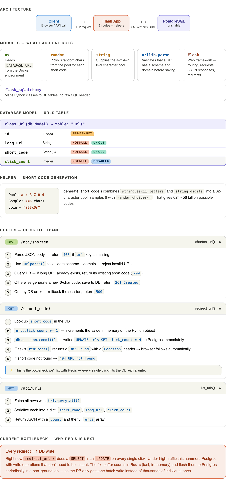

# 🌟 Tiny URL System Design - Hands On

## 🚀 Introduction

The TinyURL system is a practical implementation of URL shortening technology
that demonstrates core systems design principles. This project provides a
hands-on approach to understanding backend services, database design,
containerization, and API development.

This document serves as both a technical reference and a learning tool,
showcasing how to build a fully functional URL shortening service from scratch
using modern technologies.

## 📚 1. System Architecture

### 1.1 High Level Overview

<p align="center">

</p>

### 1.2 Low Level Overview

<p align="center">

</p>

## 📁 2. Code Structure

**Directory structure**

```bash
tiny-url/
├── app.py             # Flask backend
├── Dockerfile         # Docker configuration
├── requirements.txt   # Python dependencies
└── docker-compose.yml # Docker orchestration
```

## 📁 3. Usage

### 3.1 💻 Software Requirements

Before running the TinyURL system, ensure you have the following installed on
your machine:

🐳 **Docker**

- **Description**: A platform for developing and shipping software with containers
- **Installation Guide**: [Get Started with Docker]
- **Command to Verify**: `🦄❯ docker --version`

🐳📄 **Docker Compose**

- **Description**: A tool for defining and running multi-container Docker applications
- **Installation Guide**: [Set up Docker Compose]
- **Command to Verify**: `🦄❯ docker-compose --version`

🌱 **Git**

- **Description**: A version control system for tracking changes in source code
- **Installation Guide**: [Install Git]
- **Command to Verify**: `🦄❯ git --version`

### 3.2 🌐 Cloning the GitHub Repository

To get started with the TinyURL system, clone the GitHub repository:

```bash
# Option 1: HTTPS
🦄❯ git clone https://github.com/verofa/systems-design.git

# Option 2: SSH (requires SSH keys set up)
🦄❯ git clone git@github.com:verofa/systems-design.git
```

After cloning, change into the project directory:

```bash
🦄❯ cd systems-design/tiny-url/monolithic
```

### 3.3 **Start the system**

```bash
🦄❯ docker-compose up --build -d
```

**Check the status of the running service**

```bash
🦄❯ docker-compose ps
NAME             IMAGE          COMMAND           SERVICE   CREATED          STATUS          PORTS
tiny-url-app-1   tiny-url-app   "python app.py"   app       19 seconds ago   Up 18 seconds   0.0.0.0:5000->5000/tcp
```

**Tail the logs**

```bash
🦄❯ docker-compose logs -f --tail=200 app
app-1  |  * Serving Flask app 'app'
app-1  |  * Debug mode: on
app-1  | WARNING: This is a development server. Do not use it in a production deployment.
Use a production WSGI server instead.
app-1  |  * Running on all addresses (0.0.0.0)
app-1  |  * Running on http://127.0.0.1:5000
app-1  |  * Running on http://172.19.0.2:5000
app-1  | Press CTRL+C to quit
app-1  |  * Restarting with stat
app-1  |  * Debugger is active!
app-1  |  * Debugger PIN: 167-628-980
```

**Test the endpoints**

- Shorten a URL:

```bash
 🦄❯ curl -X POST \
    -H "Content-Type: application/json" \
    -d '{"url": "https://example.com"}' \
    http://localhost:5000/api/shorten
```

- Check the short URL from the result of the above `curl` command:

```bash
 🦄❯ curl http://localhost:5000/abc123
```

[Accepts JSON and expect `url` field]: https://github.com/verofa/systems-design/blob/e4b8b55b9297435c062eda8f4b43f4ee5e114241/tiny-url/app.py#L15-L22v
[Redirect to original URL]: https://github.com/verofa/systems-design/blob/e4b8b55b9297435c062eda8f4b43f4ee5e114241/tiny-url/app.py#L56-L59
[Get Started with Docker]: https://docs.docker.com/get-started/get-docker/
[Set up Docker Compose]: https://docs.docker.com/compose/install/
[Install Git]: https://git-scm.com/install/
